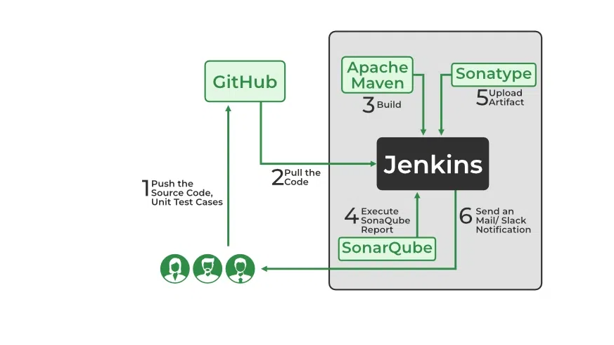
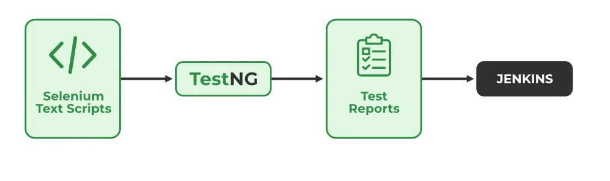
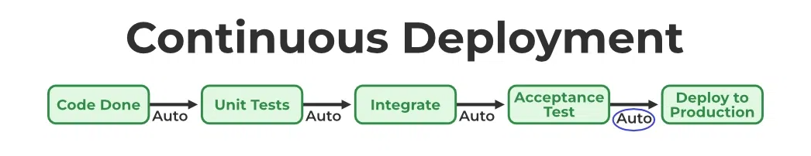
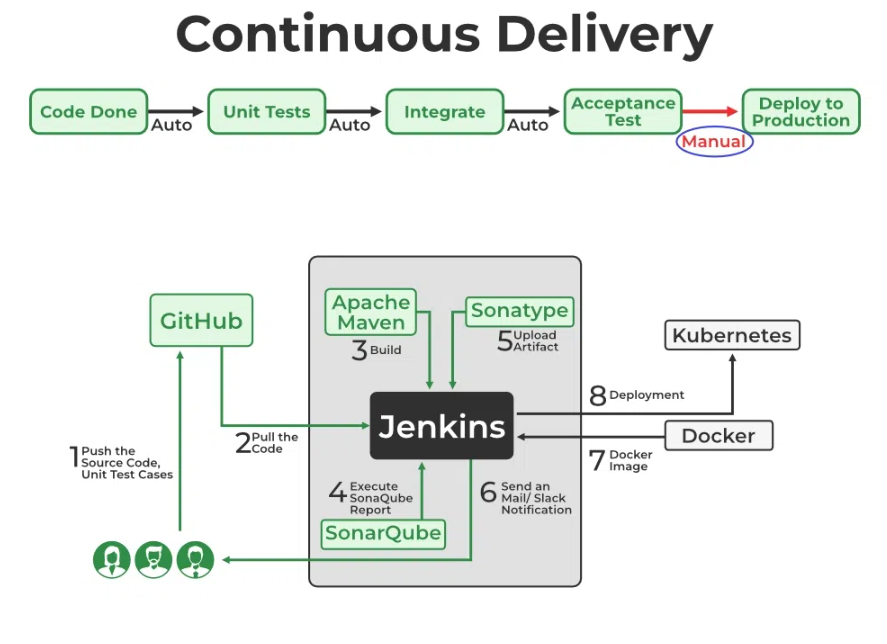

---

# Devops Life Cycle
> [!STORY]
> ```
Let's say your team adds a new feature: "Track Delivery Person on Map."

1. Developer Meena writes code for the tracking feature and pushes it to GitHub.
2. As soon as the code is pushed, Jenkins picks it up and uses Maven to build the app and test it using JUnit.
3. The code goes through SonarQube, which finds a few duplicate lines and suggests better practices.
4. Once everything is okay, the final app version (with the new feature) is saved in Nexus as a .jar file.

This way, every small change is tested, verified, and saved automatically without manual effort.


```

```
# Continuous Testing
> Continuous Testing means testing the code automatically every time there is a change. This helps catch bugs early before the app goes live. With DevOps and Agile methods, companies can use tools like Selenium, Testsigma, or LambdaTest to test their applications automatically. These tools run tests faster and smarter than manual testing.

> Using a tool like Jenkins, we can set up the entire testing process to run automatically after every code change. This saves time and reduces human errors.

> [!Example: ]
> Let’s say your team adds a new feature: "Apply Coupon at Checkout."

After the developer pushes this new feature to GitHub, Jenkins automatically starts the testing process. Tools like Selenium or Testsigma test:

Does the coupon code apply correctly?
Does the final price update as expected?
Does the checkout process still work?
If a problem is found, for example, the app crashes when a wrong coupon is entered the test will fail, and the developer will be notified immediately to fix it. This way, the team avoids pushing broken features to production and ensures the app remains reliable.

```

---


---
# 4. Continuous Deployment/ Continuous Delivery
> Continuous Deployment: Continuous Deployment is the process of automatically deploying an application into the production environment when it has completed testing and the build stages. Here, we'll automate everything from obtaining the application's source code to deploying it.

### Continuous Deployment

 
> Continuous Delivery: Continuous Delivery is the process of deploying an application into production servers manually when it has completed testing and the build stages. Here, we will automate the continuous integration processes, however, manual involvement is still required for deploying it to the production environment.

```
## Example:
> Suppose the team adds a “Refer & Earn” feature.

* The code is developed, tested, and marked as ready to go live.
* However, the product team decides to launch it during a weekend campaign.
* Until then, the feature stays on standby in the staging area.

```
>[!NOTE]
> Continuous Delivery ensures every update is deployable anytime, but the actual release can be controlled.


---

---
# Popular DevOps Lifecycle Tools
The following table shows the list of popular DevOps tools:

1. Plan
Tools: Jira, Trello, Asana
Used for task planning, assignment, and progress tracking.
2. Develop
Tools: Git, GitHub, GitLab, Bitbucket
Enables version control, code collaboration, and branching.
3. Build
Tools: Jenkins, Maven, Gradle
Automates the process of compiling code and managing dependencies.
4. Test
Tools: Selenium, JUnit, TestNG, SonarQube
Conducts automated testing for bugs, code quality, and security vulnerabilities.
5. Release/Deploy
Tools: ArgoCD, GitLab CI/CD, AWS CodeDeploy, Azure DevOps, Spinnaker, Terraform
Automates deployment pipelines and software releases.
6. Operate
Tools: Terraform, Ansible, Puppet, Chef
Handles infrastructure provisioning and configuration management.
7. Monitor
Tools: Prometheus, Grafana, ELK Stack, Datadog
Tracks performance, logs, metrics, and system health.
---